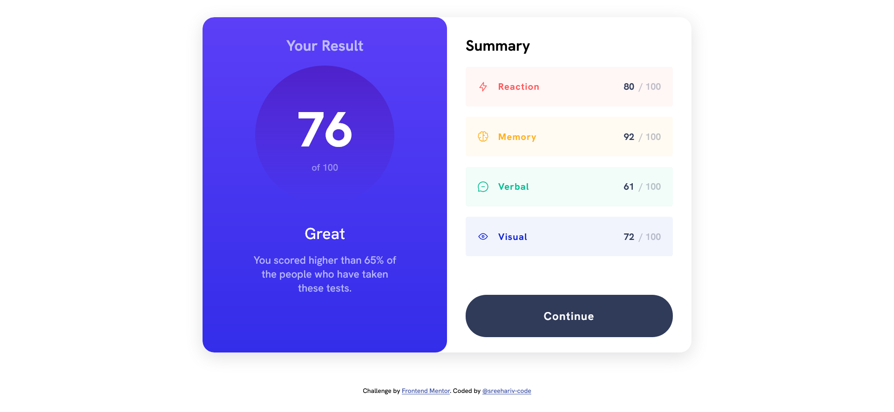
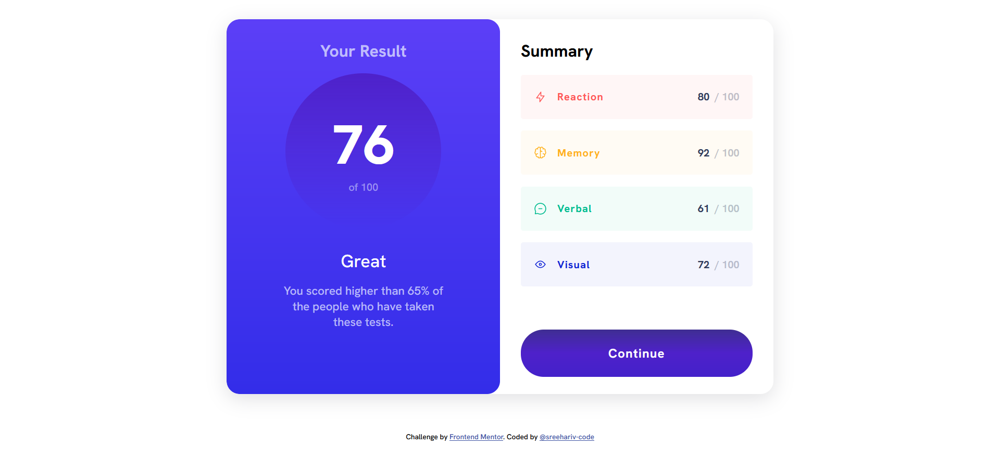
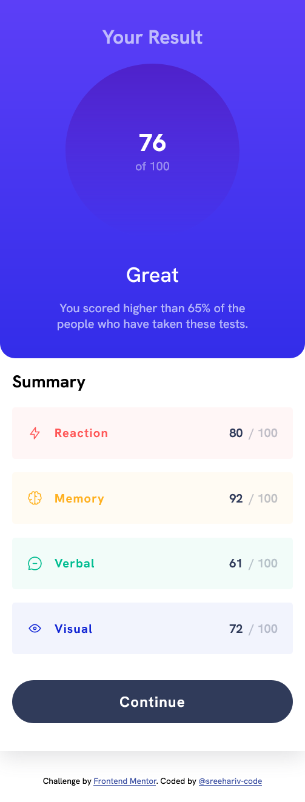

# Frontend Mentor - Results summary component solution

This is a solution to the [Results summary component challenge on Frontend Mentor](https://www.frontendmentor.io/challenges/results-summary-component-CE_K6s0maV). Frontend Mentor challenges help you improve your coding skills by building realistic projects.

## Table of contents

- [Overview](#overview)
  - [The challenge](#the-challenge)
  - [Screenshot](#screenshot)
  - [Links](#links)
- [My process](#my-process)
  - [Built with](#built-with)
  - [What I learned](#what-i-learned)
- [Author](#author)

## Overview

### The challenge

Users should be able to:

- View the optimal layout for the interface depending on their device's screen size
- See hover and focus states for all interactive elements on the page
- **Bonus**: Use the local JSON data to dynamically populate the content

### Screenshot

- <b>Desktop View</b>
  
- <b>Active State</b>
  
- <b>Mobile View</b>
  

### Links

- Solution URL: Click [Here](https://github.com/sreehariv-code/result-summary-component)
- Live Site URL: Click [Here](https://sreehariv-code.github.io/result-summary-component/)

## My process

### Built with

- Semantic HTML5 markup
- CSS custom properties
- Flexbox
- CSS Grid
- Desktop-first workflow

### What I learned

Using this session, the major thing that I have learned to integrate into the project was animating linear-gradient over hover state using background-size and background-position property.

This is how I achieved the same

```css
.btn {
  /*Other Button properties*/
  background: linear-gradient(
    to bottom,
    hsl(224, 30%, 27%),
    hsl(224, 30%, 27%),
    hsla(256, 72%, 46%, 1) 50%,
    hsla(241, 72%, 46%, 1)
  );
  background-size: 100% 400%;
  transition: background 1.3s ease;
}

.btn:hover {
  background-position: 300%;
}
```

- Website - [Add your name here](https://www.your-site.com)
- Frontend Mentor - [@yourusername](https://www.frontendmentor.io/profile/yourusername)
- Twitter - [@yourusername](https://www.twitter.com/yourusername)

## Author

- [Github](https://github.com/sreehariv-code)
- [Frontend Mentor](https://www.frontendmentor.io/profile/sreehariv-code)
